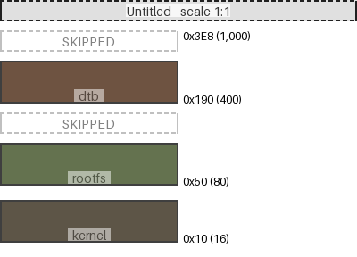
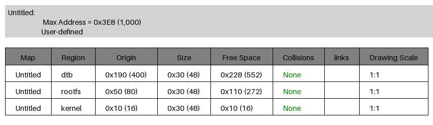

[](https://github.com/cracked-machine/mmdiagram/actions/workflows/python-app.yml)
[](https://app.codecov.io/gh/cracked-machine/mmdiagram)

Tool for generating diagrams that show the mapping of regions in memory, specifcally for visualising and troubleshooting region overlap/collision.

||
|:-:|
||
||

As well as the `png` format diagram image, a `markdown` report is also created:
- inline image of the diagram
- collision data table

More examples can be found in [doc/example/main.md](doc/example/main.md)

### Usage:

```
usage: diagram.py [-h] [-o OUT] [-l LIMIT] [-s SCALE] [-v VOIDTHRESHOLD] [regions ...]

usage: diagram.py [-h] [-o OUT] [-l LIMIT] [-t THRESHOLD] [-n NAME] [-f FILE] [regions ...]

Generate a diagram showing how binary regions co-exist within memory.

positional arguments:
  regions               command line input for regions should be tuples of name, origin and size.

options:
  -h, --help            show this help message and exit
  -o OUT, --out OUT     path to the markdown output report file. Default: "out/report.md"
  -l LIMIT, --limit LIMIT
                        The height for the diagram. Please use hex. Memory regions exceeding this height will be
                        scaled to fit. Ignored when using JSON file input.
  -t THRESHOLD, --threshold THRESHOLD
                        The threshold for skipping void sections. Please use hex.
  -n NAME, --name NAME  Provide a name for the memory map. Ignored when JSON file is provided.
  -f FILE, --file FILE  JSON input file for multiple memory maps (and links) support. Please see
                        doc/example/input.json for help.
```

- Generate five regions called `kernel`, `rootfs`, `dtb`, `uboot` and `uboot-scr` where four of the five regions intersect/collide. The default report output path is used. Diagram output is shown at the top of the page.

    ```
    python3 -m mm.diagram kernel 0x10 0x50 rootfs 0x50 0x30 dtb 0x90 0x30 uboot 0xD0 0x50 uboot-scr 0x110 0x30
    ```

- Using JSON the same options (plus many others) can be set. See example files in [doc/example](doc/example) folder.


