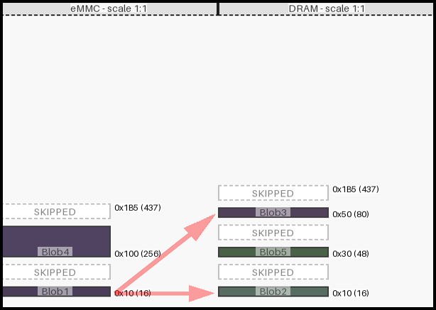
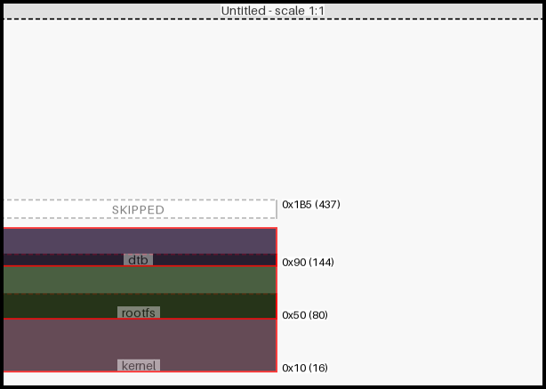

[](https://github.com/cracked-machine/mmdiagram/actions/workflows/python-app.yml)
[](https://app.codecov.io/gh/cracked-machine/mmdiagram)

Tool for generating diagrams that show the mapping of regions in memory, specifcally for visualising and troubleshooting region overlap/collision.

||
|:-:|
||
||

### Features

- Regions are plotted onto a diagram. Freespace is measured and put into the accompanying table.
- Region collisions are highlighted on the diagram and in the accompnaying table. The table will detail which regions have collided as well as related measurements.

  
  

- The output is available as:
    - separate images for diagram and table.
    - markdown table with inline diagram image.
- Command line and JSON input are supported. NOTE: Command line input has a limited subset of features compared to JSON input.. Some extra features available with JSON input are:
    - Multi map support with links
    - All graphic properties are available
    - Max address and diagram size

- Diagram width and height can be specified using JSON. The contents will be automatically draw to the correct scale within the requested diagram size. If height is not set then the correct height will be calculated from the region data. NOTE: Command line input can ONLY set both the diagram height and max address simulataneously using the 'limit' option. 
- Max address can be set using JSON. If this is higher than the diagram height, the contents will be scaled. If regions exceed this max address, the collision will be highlighted both in the diagram and table. 

  
  

  If max address is not set then the diagram height will be used. NOTE: Command line input can ONLY set both the diagram height and max address simulataneously using the 'limit' option.

- Many additional settings are available in the JSON input. Please see the [schema](mm/schema.json) for more information. 


### Usage:

```
python3 -m mm.diagram -h
```

```
usage: diagram.py [-h] [-o OUT] [-l LIMIT] [-t THRESHOLD] [-n NAME] [-f FILE] [-v] [--no_whitespace_trim] [regions ...]

Generate a diagram showing how binary regions co-exist within memory.

positional arguments:
  regions               Sequence of region data. Should be tuples of name, origin and size: <name1> <origin1> <size1> <nameN> <originN> <sizeN>

options:
  -h, --help            show this help message and exit
  -o OUT, --out OUT     The path to the markdown output report file. Diagram and table images will be written using this path and name (using png extension). Default:
                        'out/report.md'
  -l LIMIT, --limit LIMIT
                        The 'height' in pixels and 'max address' in bytes for the diagram. Please use hex format. Ignored when using JSON file input. Memory regions exceeding
                        this value will be scaled to fit when drawn but collision measurements will use the original value. If you need to set 'height' and 'max address' to
                        different values, please use the JSON input file instead.
  -t THRESHOLD, --threshold THRESHOLD
                        The threshold for replacing large empty sections with 'SKIPPED' regions. Any space over this value will be replaced. Please use hex. Default = 0x16
  -n NAME, --name NAME  Provide a name for the memory map. Ignored when JSON file is provided.
  -f FILE, --file FILE  JSON input file for multiple memory maps (and links) support. Please see docs/example for help.
  -v                    Enable debug output.
  --no_whitespace_trim  Force disable of whitespace trim in diagram images. If this option is set, diagram images may be created larger than requested.
```

#### Examples

- Generate five regions called `kernel`, `rootfs`, `dtb`, `uboot` and `uboot-scr` where four of the five regions intersect/collide. The default report output path is used. 

    ```
    python3 -m mm.diagram kernel 0x10 0x50 rootfs 0x50 0x30 dtb 0x90 0x30 uboot 0xD0 0x50 uboot-scr 0x110 0x30 -l 0x3e8
    ```

- Using JSON many other options can be set. Example json files can be found [here](https://cracked-machine.github.io/mmdiagram/examples.html)

    ```
    python3 -m mm.diagram -f docs/example/input.json
    ```

