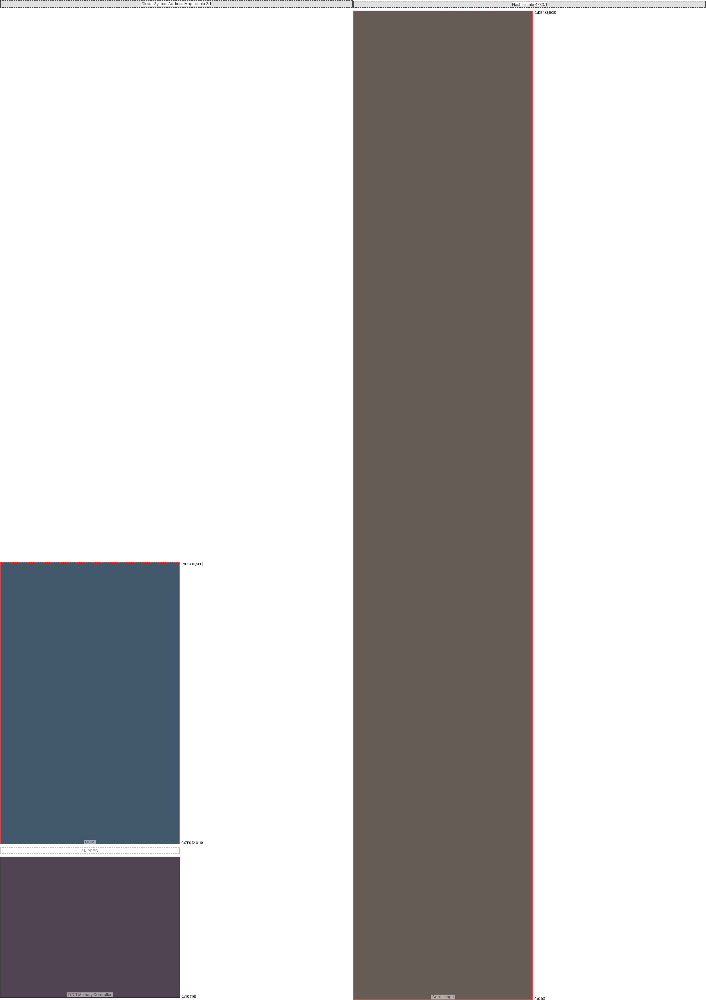

|region (parent)|origin|size|free Space|collisions|links|draw scale|
|:-|:-|:-|:-|:-|:-|:-|
|OCM (Global System Address Map)|0x7e0 (2016)|0x7d0 (2000)|-0x1fc (-508)| end @ 0xdb4 ||2:1|
|DDR Memory Controller (Global System Address Map)|0x10 (16)|0x3e8 (1000)|0x3e8 (1000)|||2:1|
|Boot Image (Flash)|0x0 (0)|0xffffff (16777215)|-0xfff24b (-16773707)| end @ 0xdb4 ||4783:1|

---
#### Global System Address Map:
- max address = 0xDB4 (3,508)
- Calculated from region data
#### Flash:
- max address = 0xDB4 (3,508)
- Calculated from region data