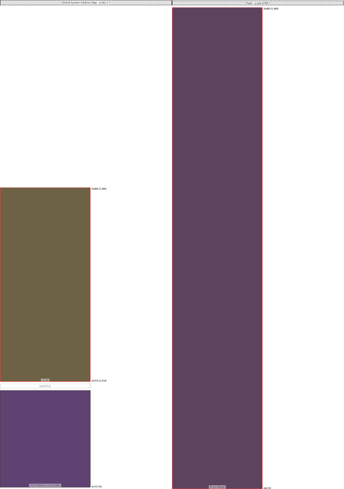

|region (parent)|origin|size|free Space|collisions|links|draw scale|
|:-|:-|:-|:-|:-|:-|:-|
|OCM (Global System Address Map)|0x7e0 (2016)|0x7d0 (2000)|-0x600 (-1536)| end @ 0x9b0 ||2:1|
|DDR Memory Controller (Global System Address Map)|0x10 (16)|0x3e8 (1000)|0x3e8 (1000)|||2:1|
|Boot Image (Flash)|0x0 (0)|0xffffff (16777215)|-0xfff64f (-16774735)| end @ 0x9b0 ||6766:1|

---
#### Global System Address Map:
- max address = 0x9B0 (2,480)
- Calculated from region data
#### Flash:
- max address = 0x9B0 (2,480)
- Calculated from region data