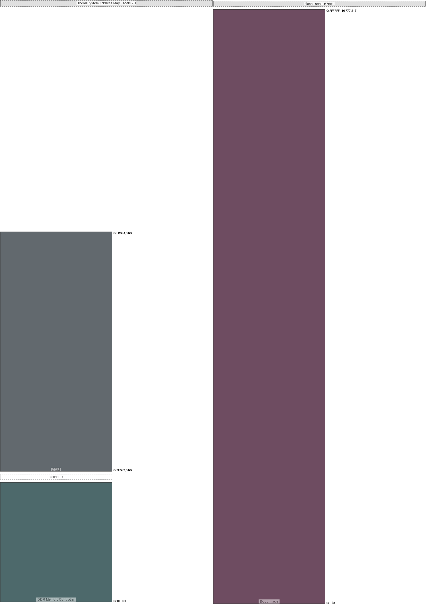

|region (parent)|origin|size|free Space|collisions|links|draw scale|
|:-|:-|:-|:-|:-|:-|:-|
|OCM (Global System Address Map)|0x7e0 (2016)|0x7d0 (2000)|0x0 (0)|||2:1|
|DDR Memory Controller (Global System Address Map)|0x10 (16)|0x3e8 (1000)|0x3e8 (1000)|||2:1|
|Boot Image (Flash)|0x0 (0)|0xffffff (16777215)|0x0 (0)|||6766:1|

---
#### Global System Address Map:
- max address = 0xFB0 (4,016)
- Calculated from region data
#### Flash:
- max address = 0xFFFFFF (16,777,215)
- Calculated from region data