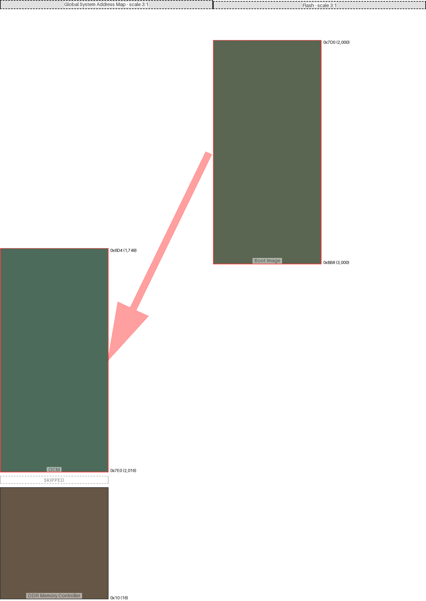

|region (parent)|origin|size|free Space|collisions|links|draw scale|
|:-|:-|:-|:-|:-|:-|:-|
|Boot Image (Flash)|0xbb8 (3000)|0x7d0 (2000)|-0xbb8 (-3000)| end @ 0x7d0 |('Global System Address Map', 'OCM')|3:1|
|OCM (Global System Address Map)|0x7e0 (2016)|0x7d0 (2000)|-0x8dc (-2268)| end @ 0x6d4 ||3:1|
|DDR Memory Controller (Global System Address Map)|0x10 (16)|0x3e8 (1000)|0x3e8 (1000)|||3:1|

---
#### Global System Address Map:
- max address = 0x6D4 (1,748)
- Calculated from region data
#### Flash:
- max address = 0x7D0 (2,000)
- User-defined input