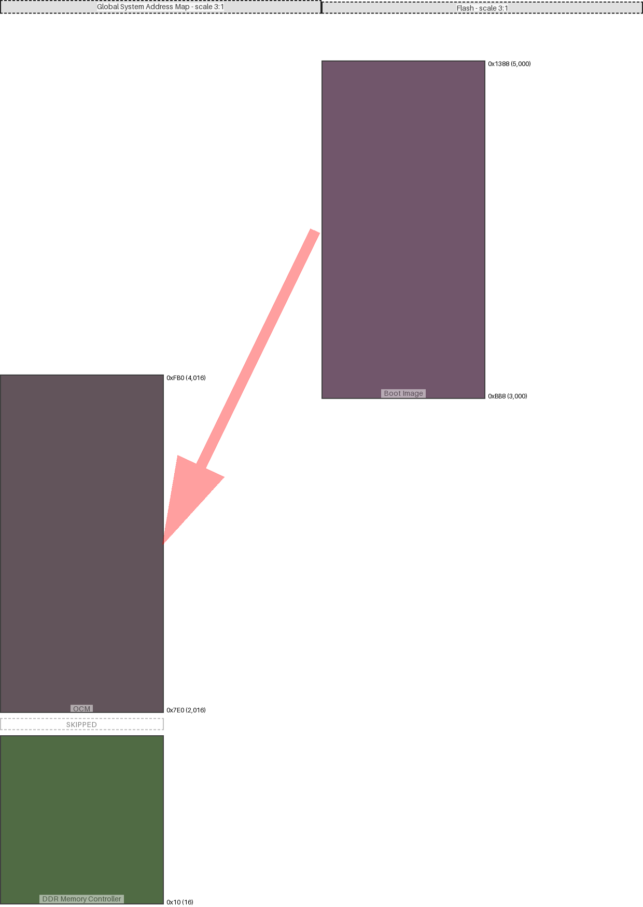

|map|region|origin|size|free Space|collisions|links|draw scale|
|:-|:-|:-|:-|:-|:-|:-|:-|
|Flash|Boot Image|0xbb8 (3000)|0x7d0 (2000)|0x0 (0)||('Global System Address Map', 'OCM')|3:1|
|Global System Address Map|OCM|0x7e0 (2016)|0x7d0 (2000)|0x0 (0)|||3:1|
|Global System Address Map|DDR Memory Controller|0x10 (16)|0x3e8 (1000)|0x3e8 (1000)|||3:1|
