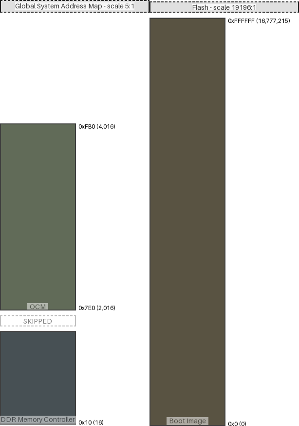

|map|region|origin|size|free Space|collisions|links|draw scale|
|:-|:-|:-|:-|:-|:-|:-|:-|
|Global System Address Map|OCM|0x7e0 (2016)|0x7d0 (2000)|0x0 (0)|||5:1|
|Global System Address Map|DDR Memory Controller|0x10 (16)|0x3e8 (1000)|0x3e8 (1000)|||5:1|
|Flash|Boot Image|0x0 (0)|0xffffff (16777215)|0x0 (0)|||19196:1|
