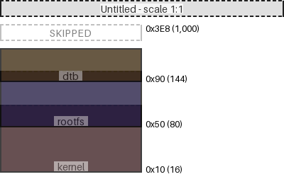

|region (parent)|origin|size|free Space|collisions|links|draw scale|
|:-|:-|:-|:-|:-|:-|:-|
|dtb (Untitled)|0x90 (144)|0x30 (48)|0x328 (808)| rootfs @ 0x90 ||1:1|
|rootfs (Untitled)|0x50 (80)|0x50 (80)|-0x10 (-16)| kernel @ 0x50   dtb @ 0x90 ||1:1|
|kernel (Untitled)|0x10 (16)|0x60 (96)|-0x20 (-32)| rootfs @ 0x50 ||1:1|

---
#### Untitled:
- max address = 0x3E8 (1,000)
- User-defined input