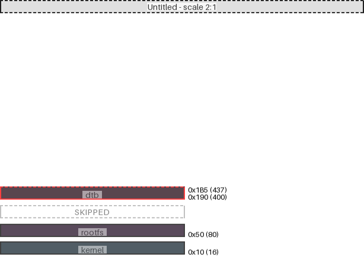

|region (parent)|origin|size|free Space|collisions|links|draw scale|
|:-|:-|:-|:-|:-|:-|:-|
|dtb (Untitled)|0x190 (400)|0x30 (48)|-0xb (-11)| end @ 0x1b5 ||2:1|
|rootfs (Untitled)|0x50 (80)|0x30 (48)|0x110 (272)|||2:1|
|kernel (Untitled)|0x10 (16)|0x30 (48)|0x10 (16)|||2:1|

---
#### Untitled:
- max address = 0x1B5 (437)
- User-defined input