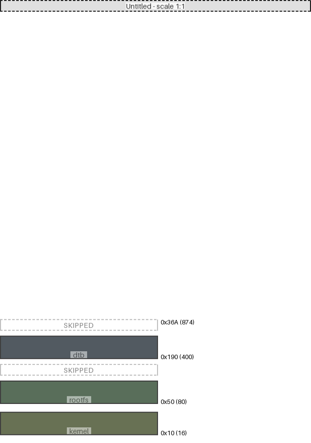

|region (parent)|origin|size|free Space|collisions|links|draw scale|
|:-|:-|:-|:-|:-|:-|:-|
|dtb (Untitled)|0x190 (400)|0x30 (48)|0x1aa (426)|||1:1|
|rootfs (Untitled)|0x50 (80)|0x30 (48)|0x110 (272)|||1:1|
|kernel (Untitled)|0x10 (16)|0x30 (48)|0x10 (16)|||1:1|

---
#### Untitled:
- max address = 0x36A (874)
- User-defined input