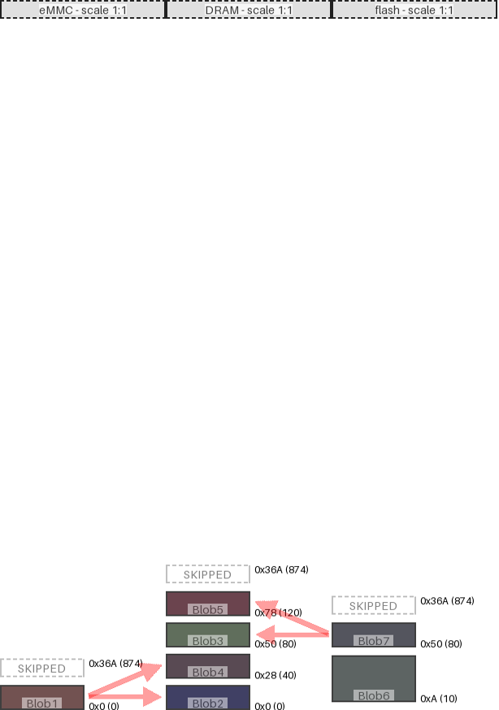

|region (parent)|origin|size|free Space|collisions|links|draw scale|
|:-|:-|:-|:-|:-|:-|:-|
|Blob5 (DRAM)|0x78 (120)|0x20 (32)|0x2d2 (722)|||1:1|
|Blob3 (DRAM)|0x50 (80)|0x20 (32)|0x8 (8)|||1:1|
|Blob7 (flash)|0x50 (80)|0x20 (32)|0x2fa (762)||('DRAM', 'Blob3') ('DRAM', 'Blob5')|1:1|
|Blob4 (DRAM)|0x28 (40)|0x20 (32)|0x8 (8)|||1:1|
|Blob6 (flash)|0xa (10)|0x3c (60)|0xa (10)|||1:1|
|Blob1 (eMMC)|0x0 (0)|0x20 (32)|0x34a (842)||('DRAM', 'Blob2') ('DRAM', 'Blob4')|1:1|
|Blob2 (DRAM)|0x0 (0)|0x20 (32)|0x8 (8)|||1:1|

---
#### eMMC:
- max address = 0x36A (874)
- Calculated from region data
#### DRAM:
- max address = 0x36A (874)
- Calculated from region data
#### flash:
- max address = 0x36A (874)
- Calculated from region data