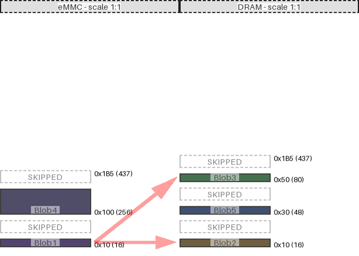

|region (parent)|origin|size|free Space|collisions|links|draw scale|
|:-|:-|:-|:-|:-|:-|:-|
|Blob4 (eMMC)|0x100 (256)|0x30 (48)|0x85 (133)|||1:1|
|Blob3 (DRAM)|0x50 (80)|0x10 (16)|0x155 (341)|||1:1|
|Blob5 (DRAM)|0x30 (48)|0x10 (16)|0x10 (16)|||1:1|
|Blob1 (eMMC)|0x10 (16)|0x10 (16)|0xe0 (224)||('DRAM', 'Blob2') ('DRAM', 'Blob3')|1:1|
|Blob2 (DRAM)|0x10 (16)|0x10 (16)|0x10 (16)|||1:1|

---
#### eMMC:
- max address = 0x1B5 (437)
- Calculated from region data
#### DRAM:
- max address = 0x1B5 (437)
- Calculated from region data