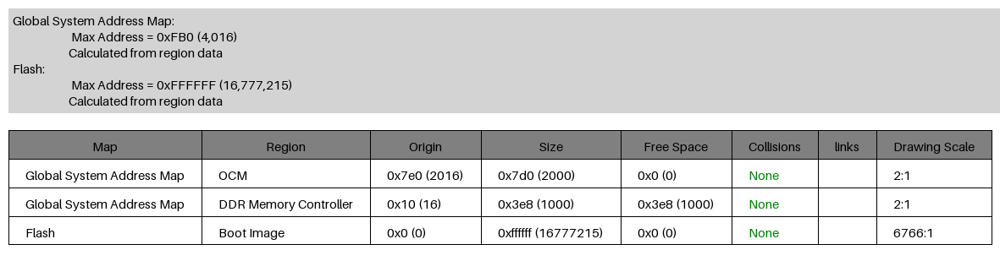

|description|diagram|
|:-:|:-:|
|No overlapping memory regions||
|||
|Overlapping memory regions||
|||
|Two Memory Maps||
|||
|Three Memory Maps||
|||
|Drawing ratios (1000x1000)||
|||
|A4 Drawing ratios (3508x2480)||
|||