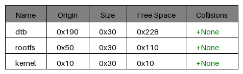

|description|options|diagram|summary|
|:-:|:-:|:-:|:-:|
|No overlapping memory regions|<b>max height:</b> 1000 (0x3e8) bytes, <b>void threshold:</b> 200 (0xC8) bytes|||
|Overlapping memory regions|<b>max height:</b> 1000 (0x3e8) bytes, <b>void threshold:</b> 200 (0xC8) bytes|||
