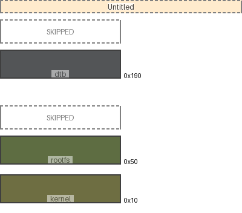

|map|region|origin|size|free Space|collisions|links|draw scale|
|:-|:-|:-|:-|:-|:-|:-|:-|
|Untitled|dtb|0x190 (400)|0x30 (48)|0x228 (552)|||1:1|
|Untitled|rootfs|0x50 (80)|0x30 (48)|0x110 (272)|||1:1|
|Untitled|kernel|0x10 (16)|0x30 (48)|0x10 (16)|||1:1|
