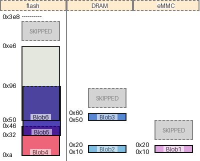

|name|origin|size|free Space|collisions
|:-|:-|:-|:-|:-|
|Blob5|0x78|0x20|0x350|{}|
|Blob3|0x50|0x20|0x8|{}|
|Blob7|0x50|0x20|0x378|{}|
|Blob4|0x28|0x20|0x8|{}|
|Blob6|0xa|0x3c|0xa|{}|
|Blob1|0x0|0x20|0x3c8|{}|
|Blob2|0x0|0x20|0x8|{}|
