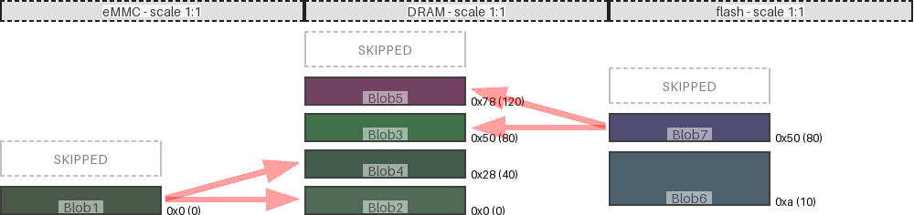

|map|region|origin|size|free Space|collisions|links|draw scale|
|:-|:-|:-|:-|:-|:-|:-|:-|
|DRAM|Blob5|0x78 (120)|0x20 (32)|0x350 (848)|||1:1|
|DRAM|Blob3|0x50 (80)|0x20 (32)|0x8 (8)|||1:1|
|flash|Blob7|0x50 (80)|0x20 (32)|0x378 (888)||('DRAM', 'Blob3') ('DRAM', 'Blob5')|1:1|
|DRAM|Blob4|0x28 (40)|0x20 (32)|0x8 (8)|||1:1|
|flash|Blob6|0xa (10)|0x3c (60)|0xa (10)|||1:1|
|eMMC|Blob1|0x0 (0)|0x20 (32)|0x3c8 (968)||('DRAM', 'Blob2') ('DRAM', 'Blob4')|1:1|
|DRAM|Blob2|0x0 (0)|0x20 (32)|0x8 (8)|||1:1|
