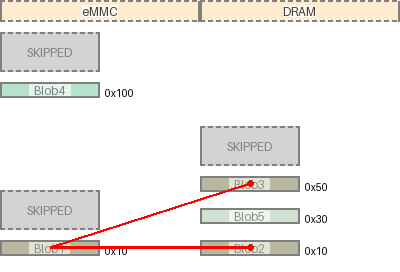

|map|region|origin|size|free Space|collisions|links|draw scale|
|:-|:-|:-|:-|:-|:-|:-|:-|
|eMMC|Blob4|0x100 (256)|0x10 (16)|0x2d8 (728)|||1:1|
|DRAM|Blob3|0x50 (80)|0x10 (16)|0x388 (904)|||1:1|
|DRAM|Blob5|0x30 (48)|0x10 (16)|0x10 (16)|||1:1|
|eMMC|Blob1|0x10 (16)|0x10 (16)|0xe0 (224)||('DRAM', 'Blob2') ('DRAM', 'Blob3')|1:1|
|DRAM|Blob2|0x10 (16)|0x10 (16)|0x10 (16)|||1:1|
