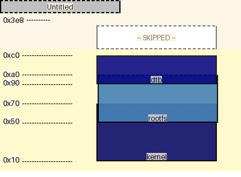

|name|origin|size|free Space|collisions
|:-|:-|:-|:-|:-|
|dtb|0x90|0x30|0x328|{'rootfs': '0x90'}|
|rootfs|0x50|0x50|-0x10|{'kernel': '0x50', 'dtb': '0x90'}|
|kernel|0x10|0x60|-0x20|{'rootfs': '0x50'}|
