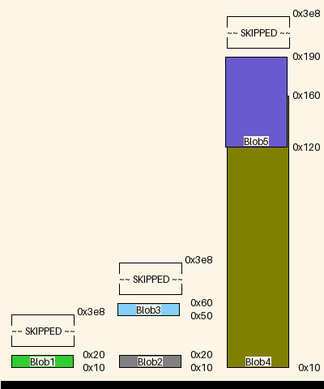

|name|origin|size|free Space|collisions
|:-|:-|:-|:-|:-|
|Blob6|0x50|0x96|0x302|{'Blob5': '0x50'}|
|Blob3|0x50|0x10|0x388|{}|
|Blob5|0x32|0x64|-0x46|{'Blob4': '0x32', 'Blob6': '0x50'}|
|Blob2|0x10|0x10|0x30|{}|
|Blob1|0x10|0x10|0x3c8|{}|
|Blob4|0xa|0x3c|-0x14|{'Blob5': '0x32'}|
