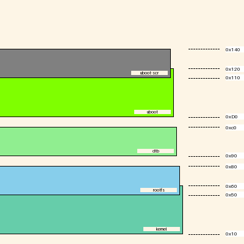

[](https://github.com/cracked-machine/mmdiagram/actions/workflows/python-app.yml)
[](https://app.codecov.io/gh/cracked-machine/mmdiagram)

Tool for mapping of regions in memory, specifcally for visualising and troubleshooting region overlap/collision.



As well as the `png` format diagram image, a `markdown` report is also created:
- inline image of the diagram
- collision data table

An example can be found in [doc/example/report.md](doc/example/report.md)

### Usage:

```
usage: mm.diagram [-h] [-o OUT] [-l LIMIT] [regions ...]

positional arguments:
  regions               command line input for regions should be tuples of name, origin and size.

options:
  -h, --help            show this help message and exit
  -o OUT, --out OUT     path to the markdown output report file. Default: "out/report.md"
  -l LIMIT, --limit LIMIT
                        The maximum memory address for the diagram. Default: 400
```

- Generate five regions called `kernel`, `rootfs`, `dtb`, `uboot` and `uboot-scr` where four of the five regions intersect/collide. The default report output path is used. Diagram output is shown at the top of the page.

    ```
    python3 -m mm.diagram kernel 0x10 0x50 rootfs 0x50 0x30 dtb 0x90 0x30 uboot 0xD0 0x50 uboot-scr 0x110 0x30
    ```


